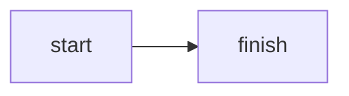

# pcg-87.github.io

Learning writeups. Live at <https://pcg-87.github.io>.

Built with Jekyll 4 and deployed by GitHub Actions. Nothing needs to be
installed locally to publish — write markdown, commit, push.

## Publishing a writeup

1. Create a file in `_posts/` named `YYYY-MM-DD-slug.md`.

   **The date prefix is mandatory.** Jekyll silently ignores files in `_posts/`
   that don't have one — no error, the post just never appears. This is the
   single most common way to lose half an hour.

2. Start it with front matter:

   ```markdown
   ---
   layout: post
   title: "What I learned about X"
   tags: [topic, another-topic]
   ---
   ```

   Tags are freeform. Each one automatically gets a `/tags/<tag>/` page; no
   registration step.

3. Write. Commit. Push to `main`. The site rebuilds in about a minute.

## Code, diagrams, images

**Code** — fenced blocks with a language get highlighted at build time by
Rouge. No JavaScript involved.

````markdown
```python
def f(x):
    return x + 1
```
````

**Diagrams** — use a `mermaid` fence. The library is fetched only on pages that
contain one, so every other page ships zero JavaScript.

````markdown

````

Mermaid renders in the browser, which means these diagrams **do not appear in
RSS readers**. For a diagram that must survive syndication, author an SVG
instead and include it as an image.

**Images** — put them in `assets/img/<post-slug>/`, then:

```liquid

```

That gives a real `<figure>`/`<figcaption>` and links the image to its
full-resolution original.

Run screenshots through the shrink tool before committing:

```bash
tools/shrink-img.sh assets/img/my-post/*.png
```

Git stores every version of every binary forever, so an unoptimised screenshot
is permanent weight in the repo. The tool only replaces a file when processing
actually makes it smaller.

## Previewing before publishing

Locally, with live reload on save:

```bash
bundle exec jekyll serve --livereload
```

Then open <http://127.0.0.1:4000>. Ruby came from Homebrew (`brew install
ruby`); if `bundle` is not found, add it to PATH with:

```bash
export PATH="/opt/homebrew/opt/ruby/bin:/opt/homebrew/lib/ruby/gems/4.0.0/bin:$PATH"
```

You can also preview without building anything: push to a branch and open a
pull request. The workflow builds it and attaches the rendered site as a
downloadable artifact on the run. Merging to `main` is what deploys.

Before pushing, the same checks CI runs:

```bash
bundle exec jekyll build && ruby tools/check_links.rb _site
```

## Layout

```
_config.yml                 site config, plugins, jekyll-archives tag pages
_layouts/                   default, post, page, tag
_includes/figure.html       captioned image linked to full size
_includes/post-meta.html    date + tag pills
_posts/                     writeups (YYYY-MM-DD-slug.md)
assets/css/main.scss        palette, typography, dual-theme Rouge colours
assets/img/<slug>/          per-writeup images
tools/shrink-img.sh         downscale screenshots (macOS sips)
tools/check_links.rb        build-time internal link check
.github/workflows/deploy.yml
```

## Notes on the setup

- **The build runs in Actions, not GitHub's built-in Jekyll.** The built-in
  build runs safe mode against a 9-plugin allow-list that excludes
  `jekyll-archives`, so tag pages would be impossible. Settings → Pages source
  must stay on *GitHub Actions*.
- **No theme gem.** Dark mode is CSS custom properties redefined under
  `prefers-color-scheme`; the released `minima` has no automatic dark mode.
- **Two Rouge colour sets** live in `main.scss`, the dark one inside the same
  media query. Rouge emits the classes at build time.
