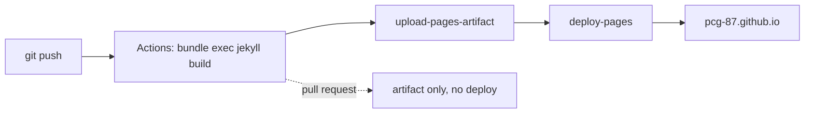

I wanted a site for learning writeups with four things: syntax highlighting,
tags, an RSS feed, and dark mode. The obvious answer is Jekyll on GitHub
Pages. The obvious answer has a catch.

## The catch

GitHub Pages will build Jekyll for you, which sounds ideal — no toolchain to
install. But that built-in build runs in **safe mode** against a fixed
allow-list of nine plugins. `jekyll-archives`, which generates tag pages, is
not on it.

> If you want to use unsupported plugins, generate your site locally and then
> push your site's static files to GitHub.

That advice is older than the fix. The modern answer is to build in GitHub
Actions, which has no plugin restrictions at all. GitHub's own docs now call
Actions the recommended approach.

## What changes

The build moves from GitHub's implicit Jekyll into a workflow you control:

```yaml
- uses: ruby/setup-ruby@v1
  with:
    ruby-version: '3.3'
    bundler-cache: true
- run: bundle exec jekyll build
  env:
    JEKYLL_ENV: production
- uses: actions/upload-pages-artifact@v3
```

The important detail is using `ruby/setup-ruby` with Bundler rather than the
`actions/jekyll-build-pages` action. That action pins its own Jekyll version,
which would quietly undo the plugin freedom that was the whole point.

One setting has to change by hand: in **Settings → Pages**, the source must be
*GitHub Actions*, not *Deploy from a branch*. The site 404s until you do.

## How the pieces fit



The dotted path is the useful part. Because the workflow also runs on pull
requests but stops before deploying, the built site is downloadable from the
run — a preview without needing Jekyll installed locally.

## Dark mode without a theme

I skipped the `minima` theme. The newest released version is 2.5.2, which has
no automatic dark mode; the `skin: auto` feature exists only on an unreleased
branch that the project warns against tracking.

Writing the layouts directly turned out to be about 250 lines, and it means
dark mode is just CSS custom properties:

```scss
:root {
  --bg: #ffffff;
  --fg: #1f2328;
}

@media (prefers-color-scheme: dark) {
  :root {
    --bg: #0d1117;
    --fg: #e6edf3;
  }
}
```

Syntax highlighting works the same way — two Rouge colour sets in one
stylesheet, the dark one scoped to the same media query. Rouge emits the
highlight classes at build time, so none of this needs JavaScript.



## What I'd tell myself at the start

Read the plugin allow-list *before* designing the site around a feature. I
picked tags first and discovered the constraint second, which is the wrong
order and cost an afternoon.

Further reading: [About GitHub Pages and Jekyll](https://docs.github.com/en/pages/setting-up-a-github-pages-site-with-jekyll/about-github-pages-and-jekyll).
