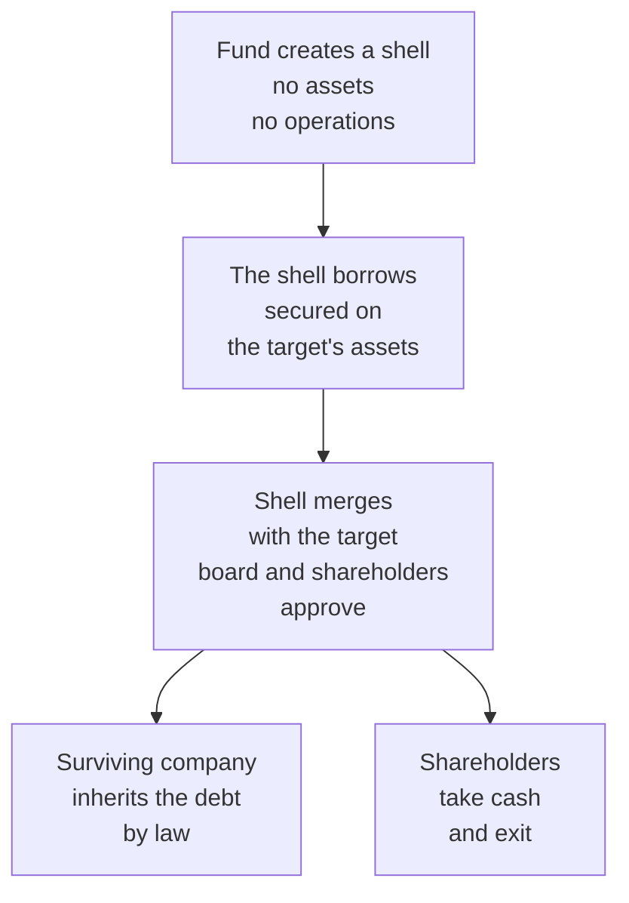
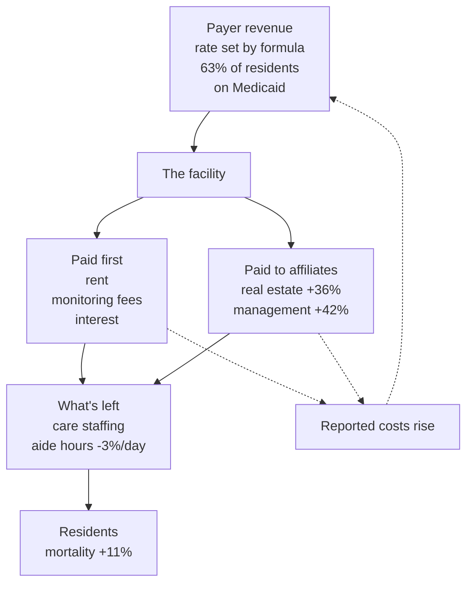

*Second in a series testing how private equity extraction works, one market at a time. This is the anchor case: the only market here with peer-reviewed evidence behind it, and the one where the money can't come out as price.*

## What I expected

I already knew the basic move: a leveraged buyout, take the property off the underlying company, load it up with debt. That part wasn't news to me. What I expected on top of it was the simple story: PE buys nursing homes and raises prices.

## What actually happened

It can't raise prices. The government sets the rate.

Residents died at a higher rate anyway. After a private equity acquisition, short-term mortality among nursing home residents rose about 11% (2 points, on a baseline where roughly one in six patients dies in the facility or within three months of leaving). Across 1,674 facilities bought in 128 deals, [the study](https://www.nber.org/papers/w28474) puts that at about 22,500 additional deaths.

So if the price never moved, how does PE make money?

## There is no price to raise

In the US there are about 14,700 certified nursing facilities. The study covers 1,674 acquisitions. The first thing I got wrong was that PE doesn't have enough concentration to leverage pricing power.

The second thing I learned is that it wouldn't matter if it did. The primary payer here is the government and the family. Medicaid is the primary payer for 63% of residents, and it sets rates by formula. Medicare does the same. No owner gets to charge a resident more for the same level of care.

There is one exception. Thirty-one states set Medicaid rates by looking at what each facility reports it spent. Gandhi and Olenski call this "an explicit or implicit cost-plus approach" that creates "a mechanical positive relationship between facilities' reported costs and their public revenues, providing a clear incentive to inflate related-party payments."

You can't charge the customer more. In most of the country you can raise your own rate, by spending more on paper.

So what's left for an owner to change?

## How the money gets out

It starts with the transaction. The first three steps I was aware of, but didn't understand how they stitched together.

**1. Buy it with the company's own borrowing power.**

In a leveraged buyout the debt sits on the business, not on the fund. This confused me for a long time. Why would a company agree to that?

It doesn't, because nobody asks it. The buyer sets up a shell company with no assets. The shell borrows the money, secured against the assets of the company it is about to buy. The shell then merges with the target, and under merger law the surviving company inherits everything both sides had, including the loan. The debt doesn't get moved onto the company. The company *becomes* the borrower.

What the board and shareholders approved was a merger, not a loan. They took cash and left. Nobody who benefited stayed behind to service it. The fund puts in a slice of equity and borrows the rest against what the company already owns. A business that owns its buildings outright is the ideal target.

**2. Take the property.** Sell the real estate, to a REIT or to an affiliate, and the proceeds go to the owners. PE transfers the land and makes the shell company rent the land back.

A building owned outright is close to free on paper after decades of depreciation. Leased back, it costs millions a year, and in a cost-based state those millions raise the facility's rate. Cost-based systems have always given owners reason to "refinance, sell, or sell-leaseback; and most such actions increase reimbursement amounts."

**3. The debt doesn't leave with the building.** This is the part I'd missed. The facility now services the borrowing *and* pays rent on a building it used to own. Both are contracts. Both get paid before anything else does.

**4. A two-way toll.** The PE firm makes fees off both sides of the transaction. It charges the facility monitoring fees. It also charges a management fee to the investors in its own fund, the pension plans and endowments that put up the money.

**5. Upsell into higher care tiers.** The rate for each level of care is fixed, but the owner has some control over which level a resident is billed at. Before 2019, Medicare paid largely by therapy minutes.

**6. Vertically integrate.** Own the pharmacy, the therapy company, the staffing agency, the management company. Get paid on more of the transactions.

Gupta and co-authors see the cost side of this directly: after acquisition, facility spending shifts toward monitoring fees, interest, and lease payments.

## What the markups actually are

That's the second study. Gandhi and Olenski went through nursing home cost reports and priced what steps 2 and 6 are worth. Their detailed cost data is Illinois, so most of what follows is an Illinois figure.

- **77% of homes** pay related parties. That one is national.
- In Illinois, related-party payments reached **12% of nursing home spending** by 2021, up from about 5.5% in 2000.
- The margins, by service: **36.1% on real estate**, **41.7% on management**, and **2.2% on therapy**, which isn't statistically significant.
- By 2019, **68% of Illinois nursing home profits** were hidden inside those markups. The average facility doing it concealed **$379,382** a year; the 95th percentile concealed **$1.29M**.

The building and the management contract are where the money is: steps 2 and 6. Within step 6 I was partly wrong. If the therapy margin is 2.2% and can't be distinguished from zero, owning the therapy company isn't where the extraction happens. Owning the management company is.

Property and management are cost lines that feed rate-setting in the states that reimburse on reported cost. Inflating them pays twice: once as profit moved to an affiliate, once as a higher rate the year after.

## Where the money has to come from

The rate is fixed. Rent, fees and interest are contracts, so they come off the top. Prices paid to affiliates are set by the owner on both sides of the deal. Labor is the biggest cost left, and the one the owner can choose to cut. The dotted line runs the other way: what leaves at the top comes back as a higher rate.

## What it did across 1,674 facilities

Back to Gupta and co-authors. Comparing acquired facilities against comparable ones that weren't acquired:

- Nurse aide hours fell about 3% per resident per day, alongside declines in nurse availability overall.
- Declines in mobility, more pain, more antipsychotic prescriptions, worse compliance with care standards.
- Short-term resident mortality rose about 11%.
- Medicare billing per stay went up 8%, paid by taxpayers.

## Case study: ManorCare

That's the average across 1,674 facilities. The deal terms come from HCP's filings with the SEC, the aftermath from contemporary reporting, and the ending from the bankruptcy declaration.

- Carlyle bought ManorCare, then the second-largest US nursing home chain, in 2007 for $6.3B, at $67 a share. Carlyle put in $1.3B of its own equity. About $3.6B was senior debt and another $1B a mezzanine loan from HCP, borrowed against the buildings ManorCare already owned.
- In 2011 it sold the real estate to HCP for $6.1B. The Washington Post reported that this let Carlyle recover its $1.3B. I could not confirm that in any filing, and every other account traces back to the Post.
- ManorCare then owed $472M a year in rent, rising 3.5% a year for the first five years, plus taxes, insurance and upkeep. The rent was new, and unlike an owned building it was a reported cost.
- Some debt did leave with the building. $2.1B of ManorCare debt that HCP itself held was retired out of the purchase price. The rent replaced it.
- Layoffs followed. One employee described one aide for 60 patients. Health citations rose from 1,584 in 2013 to nearly 2,000 in 2017.
- It filed for bankruptcy in March 2018 with $7.1B in total liabilities. That figure includes estimated future obligations under the lease, so it isn't all borrowing.
- Separately, DOJ accused ManorCare of billing unnecessary therapy at the highest-paying levels. It dropped the case in 2017 after the court excluded its expert. That's an allegation, not a finding.

## The turnaround case

The case for private equity is that it buys businesses nobody else will fix, like the owner with no heir or the company that's underperforming, and turns them around.

The same study that counted the deaths also modelled which homes got bought. Targets were larger, chain-owned, in urban counties, in states with more elderly people, and carried **lower Five Star ratings** than comparable homes before anyone bought them. On quality, these were the underperformers.

Ratings got worse. Staffing fell, residents died at a higher rate, and compliance with care standards weakened.

Two things the study doesn't say, which I had assumed it did. It never measures whether targets were profitable, and its appendix says so outright. And the lower staffing that shows up in the raw comparison is a comparison of facilities after buyout, not before.

ManorCare is the one place I can answer the financial question. At the point Carlyle bought it, it was running 89% occupancy with 73% of revenue from Medicare and private pay, the two payers that pay best. It was bought and had as much capital pulled out of it as it could carry, for a short-term profit, with the long-term costs landing somewhere else.

## What it adds up to

I came in with the fixed-price argument. It half holds. No owner can charge a resident more, and the money did come out of what was going to be spent on care. But the rate itself turned out to be movable.

That's the mechanism, not the lesson. What I learned is that when you stitch all the mechanics together, it's really about **capping your downside while keeping the upside high**. You target a company where you can get your capital back out early, and where you can charge fees on both sides for as long as you hold it.

If the rate were genuinely fixed, everything an owner took would come out of care, and there is a floor under how far that goes before the business stops working. Reimburse on reported cost and the ceiling moves instead. You can take more without the pie staying the same size, and the taxpayer funds the difference.

Carlyle had its $1.3B back in 2011. ManorCare went bankrupt in 2018. Seven years that cost the fund nothing it hadn't already recovered, and everything it pulled out in between was profit.

Heads PE wins, tails society (the resident and the taxpayer) loses.

## Caveats

- The mortality effect is concentrated in older residents with less disease burden. The authors call the effects "nuanced."
- Studies of the COVID period found PE-managed homes fared better. The sample runs 2000–2017, and owners may behave differently under scrutiny.
- Upcoding is a documented industry mechanism, but I found no study showing PE owners do it more than other owners.
- Neither is the related-party markup. Gandhi and Olenski's margins are Illinois figures, and they don't separate PE from other for-profit owners. Only the 77% is national. The chains in the Consumer Voice report aren't PE-owned either. The mechanism doesn't need PE. What PE adds is the debt and the rent stacked on top of it.
- The cost-plus loop is a documented incentive, not a measured effect. Thirty-one states reimburse on reported cost, the capital-reimbursement literature says sale-leasebacks raise reimbursement, and Gandhi and Olenski say the incentive is clear. No study I found measures that PE-owned homes' rates actually rose after a sale-leaseback.
- Selling to your own affiliate works less well than selling to an outside buyer. States cap related-party rent at the affiliate's own costs. ManorCare's buildings went to a REIT that wasn't a Carlyle affiliate, so that rent was arm's-length and fully allowable.
- Interest is weaker than rent. Rent lands on the facility's cost report; acquisition debt usually sits above the operating company, and interest is allowable only where it's tied to patient care. I did not verify how LBO interest is treated.

## The test

| | |
|---|---|
| **Who pays** | Medicaid for 63% of residents, Medicare, and families. Rates set by formula, not negotiation |
| **Alternatives at the moment of purchase** | Few. Limited capacity, usually a waiting list, and the resident is often in no position to shop |
| **Where the money came out** | Care. Aide hours down, mortality up, with prices unchanged throughout |

Next in the series: why the law lets a company be bought with its own borrowing power, and why the UK wrote a rule against it.

## Sources

- [Owner Incentives and Performance in Healthcare: Private Equity Investment in Nursing Homes — Gupta, Howell, Yannelis & Gupta, NBER Working Paper 28474](https://www.nber.org/system/files/working_papers/w28474/w28474.pdf)
- [Same paper, published version — Review of Financial Studies (2024)](https://academic.oup.com/rfs/article-abstract/37/4/1029/7441509)
- [Tunneling and Hidden Profits in Health Care — Gandhi & Olenski, NBER Working Paper 32258 (2024)](https://www.nber.org/system/files/working_papers/w32258/w32258.pdf)
- [BFI Working Paper 2021-20 (cost shift to monitoring fees, interest and lease payments)](https://bfi.uchicago.edu/wp-content/uploads/2021/02/BFI_WP_2021-20.pdf)
- [Study summary — Center for Health Care Strategies](https://www.chcs.org/resource-center-item/does-private-equity-investment-in-healthcare-benefit-patients-evidence-from-nursing-homes/)
- [The Effect of Private Equity Investment in Health Care (COVID-period caveat) — Penn LDI](https://ldi.upenn.edu/our-work/research-updates/the-effect-of-private-equity-investment-in-health-care/)
- [A Look at Nursing Facility Characteristics in 2025 — KFF](https://www.kff.org/medicaid/a-look-at-nursing-facility-characteristics/)
- [5 Key Facts About Nursing Facilities and Medicaid — KFF](https://www.kff.org/medicaid/5-key-facts-about-nursing-facilities-and-medicaid/)
- [A Look at Nursing Home Related Party Transactions — Consumer Voice](https://theconsumervoice.org/wp-content/uploads/2024/05/2023-Related-Party-Report.pdf)
- [Study: Nursing homes use related party transactions to hide profits — STAT](https://www.statnews.com/2024/03/07/nursing-homes-hide-profits-with-related-party-ploys/)
- [Analysis of nursing home capital reimbursement systems — Health Care Financing Review](https://pmc.ncbi.nlm.nih.gov/articles/PMC4193655/)
- [42 CFR 413.17, Cost to related organizations](https://www.ecfr.gov/current/title-42/chapter-IV/subchapter-B/part-413/subpart-A/section-413.17)
- [Alabama Medicaid Rule 560-X-42-.11, Property Costs (example of a related-party rent cap)](https://medicaid.alabama.gov/documents/9.0_Resources/9.2_Administrative_Code/9.2.1_Proposed_Agency_Rules/9.2.1_APA-17_560-X-42-.11_Property_Costs_3-21-17.pdf)
- [The Carlyle Group Completes Transaction with Manor Care — deal announcement filed with the SEC (2007)](https://www.sec.gov/Archives/edgar/data/765880/000110465907090606/a07-32020_1ex99d1.htm)
- [How Private Equity Drove the Nation's Second-Largest Nursing Home Chain into the Ground — Nonprofit Quarterly](https://nonprofitquarterly.org/how-private-equity-drove-the-nations-second-largest-nursing-home-chain-into-the-ground/)
- [A private equity firm purchased a major nursing home chain. What happened next? — Advisory Board](https://www.advisory.com/daily-briefing/2018/11/28/nursinghome)
- [HCR ManorCare files for bankruptcy with $7.1 billion in debt — Reuters](https://finance.yahoo.com/news/hcr-manorcare-files-bankruptcy-7-150444033.html)
- [ProMedica Senior Care (HCR ManorCare) — Wikipedia](https://en.wikipedia.org/wiki/ProMedica_Senior_Care)
- [DOJ Bows Out of ManorCare FCA Case — Inside the False Claims Act](https://www.insidethefalseclaimsact.com/doj-bows-out-of-manorcare-fca-case/)
- [HCR ManorCare hit with False Claims Act complaint — Fierce Healthcare](https://www.fiercehealthcare.com/antifraud/hcr-manorcare-hit-false-claims-act-complaint)

**Unverified**

- That the 2011 sale let Carlyle recover its $1.3B. The Washington Post is the origin; every other account cites back to it, and no filing states it. Flagged in the text.
- Where the rest of the $6.1B in real estate proceeds went. Not found beyond the $2.1B of HCP-held debt retired at closing.
- Upcoding as a PE-specific behavior. The mechanism is documented industry-wide, but no study isolates PE owners.
- More antipsychotic prescriptions. Reported at +50% in the 2021 working paper; I could not confirm it survives in the published version.
- Whether cost-plus rate-setting actually raised rates at PE-owned homes after sale-leaseback. The incentive and the state variation are documented. The effect is not measured anywhere I found.
- How LBO acquisition interest is treated for reimbursement. Not verified.
- "Cap the downside" as a general PE design principle. ManorCare demonstrates it and the early-capital-return mechanism is documented industry-wide, but no source states it as a rule that always holds.

**Resolved by the fact review**

- The 68% figure is Illinois, not national. Corrected in the text.
- The deaths figure is ~22,500 in the published version, not 20,000, and it is the authors' own number rather than an extrapolation of mine.
- Medicare billing per stay is 8% in the published version. The 11-19% range came from mixing two versions of the paper.
- ManorCare's purchase price is $6.3B, confirmed in HCP's SEC filing.
