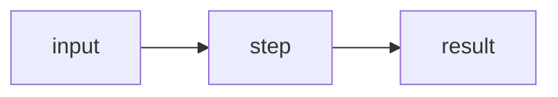

## The question

What sent me here, in two or three sentences. Not "what is X" but the actual
thing I wanted to resolve.

## How it works

The mechanics, in my own words. If I can't write this without hedging, I
haven't understood it yet.

A mermaid fence is the cheapest way to show a mechanism:

## The strongest case for

The best version of this position — the one a smart proponent would actually
recognise as their argument. Not the version that's easy to knock down.

## The strongest case against

Same standard, other direction. If this section is noticeably weaker than the
one above, I've steelmanned one side and strawmanned the other, which is worse
than not trying.

## Where I landed

What I actually think, and why. This section exists so the writeup doesn't
pretend to a neutrality it doesn't have.

## Where I was wrong / what surprised me

<!-- Optional, but usually the most valuable section.

     With a prior: what I believed and what corrected it.
     Without one: what I didn't see coming.

     Delete this section if nothing genuinely moved. Do not manufacture a
     revision to fill the space. -->

## Takeaways

The two or three things I want to still know in six months. Compressed on
purpose — if everything is a takeaway, nothing is.

## Open questions

<!-- Optional. What's still unresolved, including things I decided not to chase.
     Honest, and useful to future me. Delete if genuinely nothing is open. -->
